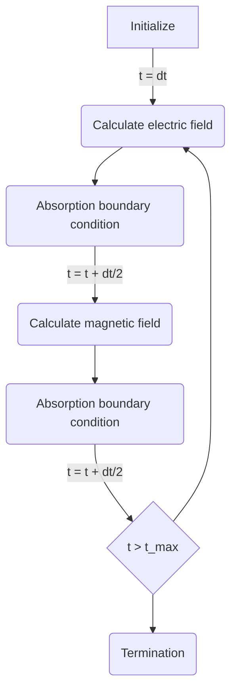
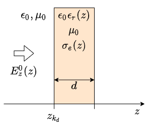
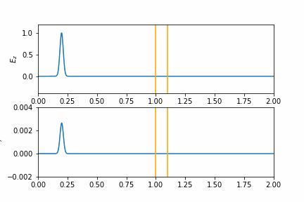
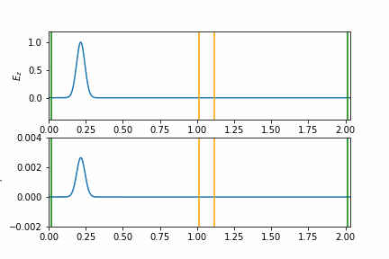

# MyFDTD
FDTD法による電磁界シミュレーション

## 1次元問題
自由空間中にある厚さ$d$の誘電体に平面波を入射した場合

    

    

        <h3>Murの吸収境界</h3>
        
    

    

        <h3>PML吸収境界</h3>
        
    

# 参考
- 数値電磁界解析のためのFDTD法 -基礎と実践- (コロナ社)