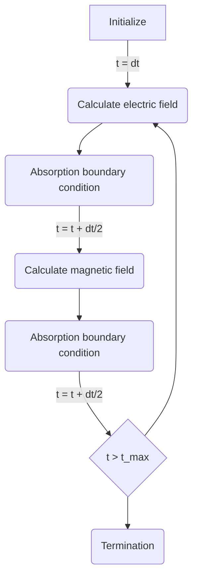
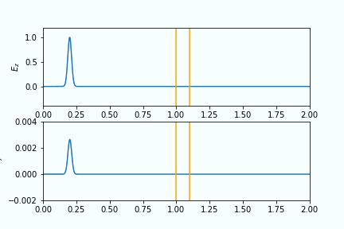

# MyFDTD
FDTD法による電磁界シミュレーション

```mermaid
graph TD
    A[Initialize] -->|t = dt| B(Calculate electric field)
    B --> C(Absorption boundary condition)
    C --> |t = t + dt/2| D(Calculate magnetic field)
    D --> E(Absorption boundary condition)
    E --> |t = t + dt/2| F{t > t_max}
    F --> B
    F --> G(Termination)
```

## 1D problem

# 参考
- 数値電磁界解析のためのFDTD法 -基礎と実践- (コロナ社)